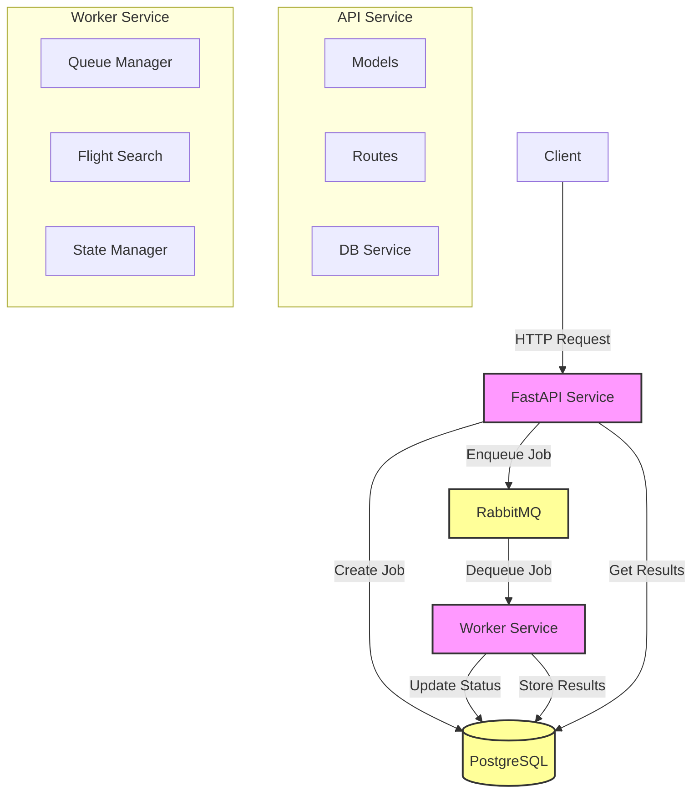

# Implementation Plan for Flight Search Service

Today is 2024-12-23

## Project Overview

A Python-based Google Flights scraper that uses Protocol Buffers for data serialization.
The package provides a fast and strongly-typed way to access Google Flights data by:

- Generating Base64-encoded Protobuf strings for the tfs query parameter
- Parsing HTML content to extract flight information
- Providing strongly-typed interfaces for flight data handling

## Architecture



### Key Components

1. **API Service**
   - FastAPI application handling HTTP requests
   - Job creation and status updates
   - Result retrieval and pagination
   - Database session management

2. **Worker Service**
   - Background job processing
   - Flight search implementation
   - State management and checkpointing
   - Rate limiting and error handling

3. **PostgreSQL Database**
   - Job and result storage
   - Status tracking
   - Data persistence
   - Concurrent access handling

4. **RabbitMQ Queue**
   - Job distribution
   - Worker coordination
   - Message persistence
   - Load balancing

### Data Flow

1. Client sends a flight search request to the API
2. API creates a job record in PostgreSQL
3. API enqueues the job in RabbitMQ
4. Worker dequeues and processes the job
5. Worker updates job status and stores results
6. Client retrieves results through the API

## Phase 1: Development Environment Setup

### Project Structure

```
flights/
├── docker/
│   ├── postgres/
│   │   └── init.sql         # Database initialization script
│   └── api/
│       └── Dockerfile       # API and worker Dockerfile
├── src/
│   ├── api/
│   │   ├── models/         # SQLAlchemy models
│   │   │   ├── base.py
│   │   │   ├── jobs.py
│   │   │   └── flights.py
│   │   ├── routers/        # API endpoints
│   │   │   └── flights.py
│   │   ├── db/            # Database layer
│   │   │   └── session.py
│   │   ├── config.py      # API configuration
│   │   └── main.py        # FastAPI application
│   ├── worker/
│   │   ├── main.py        # Worker entry point
│   │   └── queue.py       # RabbitMQ integration
│   └── config.py          # Shared configuration
├── tests/
├── docker-compose.yml      # Docker services configuration
├── pyproject.toml         # Project dependencies
├── uv.lock               # UV lock file
└── README.md
```

### Dependencies

- Python 3.12+
- FastAPI for REST API
- SQLAlchemy for database ORM
- PostgreSQL for data storage
- RabbitMQ for message queue
- UV for package management

### Docker Services

1. PostgreSQL (15-alpine)

   - Persistent storage
   - Initialization script for schema
   - Health checks
2. RabbitMQ (3-management-alpine)

   - Message queue for job processing
   - Management UI
   - Health checks
3. API Service

   - FastAPI application
   - Hot reload for development
   - Environment variables for configuration
   - Volume mount for code changes
4. Worker Service

   - Background job processor
   - RabbitMQ consumer
   - Shared codebase with API
5. pgAdmin (optional)

   - Database management UI
   - Development tool

## Phase 2: Database Schema

### Enums

```sql
CREATE TYPE job_status AS ENUM (
    'pending',
    'running',
    'completed',
    'failed',
    'cancelled'
);

CREATE TYPE price_indicator AS ENUM (
    'low',
    'typical',
    'high'
);
```

### Tables

```sql
-- Jobs table
CREATE TABLE jobs (
    job_id UUID PRIMARY KEY DEFAULT uuid_generate_v4(),
    departure_airports VARCHAR[] NOT NULL,
    destination_airports VARCHAR[] NOT NULL,
    outbound_dates TIMESTAMP[] NOT NULL,
    return_dates TIMESTAMP[],
    last_checkpoint TIMESTAMP,
    status job_status NOT NULL DEFAULT 'pending',
    total_combinations INTEGER NOT NULL DEFAULT 0,
    processed_combinations INTEGER NOT NULL DEFAULT 0,
    progress FLOAT NOT NULL DEFAULT 0.0,
    created_at TIMESTAMP NOT NULL DEFAULT CURRENT_TIMESTAMP,
    updated_at TIMESTAMP NOT NULL DEFAULT CURRENT_TIMESTAMP
);

-- Flight results table
CREATE TABLE flight_results (
    id UUID PRIMARY KEY DEFAULT uuid_generate_v4(),
    job_id UUID NOT NULL REFERENCES jobs(job_id) ON DELETE CASCADE,
    departure_airport VARCHAR(3) NOT NULL,
    destination_airport VARCHAR(3) NOT NULL,
    outbound_date TIMESTAMP NOT NULL,
    return_date TIMESTAMP,
    price FLOAT NOT NULL,
    airline VARCHAR(100) NOT NULL,
    stops INTEGER NOT NULL,
    duration VARCHAR(20) NOT NULL,
    current_price_indicator price_indicator NOT NULL,
    created_at TIMESTAMP NOT NULL DEFAULT CURRENT_TIMESTAMP
);
```

### Indexes

```sql
CREATE INDEX idx_flight_results_job_id ON flight_results(job_id);
CREATE INDEX idx_flight_results_price ON flight_results(price);
CREATE INDEX idx_jobs_status ON jobs(status);
```

## Phase 3: API Implementation

### Configuration

```python
class Settings(BaseSettings):
    # Project settings
    PROJECT_NAME: str = "Flight Search API"
    VERSION: str = "0.1.0"
    DEBUG: bool = False

    # Database settings
    DB_HOST: str
    DB_PORT: int
    DB_USER: str
    DB_PASSWORD: str
    DB_NAME: str
    DB_POOL_SIZE: int
    DB_MAX_OVERFLOW: int
    DB_POOL_TIMEOUT: int

    # API settings
    API_HOST: str
    API_PORT: int
    API_DEBUG: bool
    API_CORS_ORIGINS: list[str]
    API_WORKERS: int
    API_TITLE: str
    API_DESCRIPTION: str
    API_VERSION: str
    API_PREFIX: str

    # Worker settings
    WORKER_CONCURRENCY: int
    MAX_RETRIES: int
    CHECKPOINT_INTERVAL: int
    WORKER_BATCH_SIZE: int
    WORKER_RATE_LIMIT: int
    WORKER_TIME_WINDOW: int

    # RabbitMQ settings
    RABBITMQ_URL: str | None
    RABBITMQ_QUEUE_NAME: str
    RABBITMQ_EXCHANGE_NAME: str
    RABBITMQ_ROUTING_KEY: str
    RABBITMQ_PREFETCH_COUNT: int
```

### Models

```python
class Job(Base):
    """Flight search job model."""
    __tablename__ = "jobs"

    # Required fields without defaults
    departure_airports: Mapped[List[str]]
    destination_airports: Mapped[List[str]]
    outbound_dates: Mapped[List[datetime]]

    # Optional fields
    return_dates: Mapped[Optional[List[datetime]]]
    last_checkpoint: Mapped[Optional[datetime]]

    # Fields with default values
    job_id: Mapped[UUID]
    status: Mapped[str]
    total_combinations: Mapped[int]
    processed_combinations: Mapped[int]
    progress: Mapped[float]
    created_at: Mapped[datetime]
    updated_at: Mapped[datetime]

class FlightResult(Base):
    """Flight search result model."""
    __tablename__ = "flight_results"

    # Required fields without defaults
    job_id: Mapped[UUID]
    departure_airport: Mapped[str]
    destination_airport: Mapped[str]
    outbound_date: Mapped[datetime]
    price: Mapped[float]
    airline: Mapped[str]
    stops: Mapped[int]
    duration: Mapped[str]
    current_price_indicator: Mapped[str]

    # Optional fields
    return_date: Mapped[Optional[datetime]]

    # Fields with default values
    id: Mapped[UUID]
    created_at: Mapped[datetime]
```

## Phase 4: Worker Implementation

### Queue Integration

```python
class RabbitMQ:
    """RabbitMQ queue manager."""
    def __init__(self, settings: Settings):
        self.settings = settings
        self.connection = None
        self.channel = None

    async def connect(self):
        """Connect to RabbitMQ."""
        if not self.settings.rabbitmq_url:
            raise ValueError("RabbitMQ URL is not configured")

        self.connection = await aio_pika.connect_robust(
            self.settings.rabbitmq_url
        )

    async def setup(self):
        """Set up exchanges and queues."""
        exchange = await self.channel.declare_exchange(
            self.settings.RABBITMQ_EXCHANGE_NAME,
            aio_pika.ExchangeType.DIRECT,
            durable=True,
        )

        queue = await self.channel.declare_queue(
            self.settings.RABBITMQ_QUEUE_NAME,
            durable=True,
        )

        await queue.bind(
            exchange,
            routing_key=self.settings.RABBITMQ_ROUTING_KEY,
        )
```

### Worker Process

```python
class Worker:
    """Flight search worker."""
    def __init__(self, settings: Settings):
        self.settings = settings
        self.queue = RabbitMQ(settings)
        self.db = Database(settings)

    async def start(self):
        """Start the worker."""
        await self.queue.connect()
        await self.queue.setup()
        await self.process_jobs()

    async def process_jobs(self):
        """Process jobs from the queue."""
        async with self.queue.channel.iterator() as iterator:
            async for message in iterator:
                async with message.process():
                    job_id = message.body.decode()
                    await self.process_job(job_id)
```

### Flight Search Worker

- Converted `timedelta` to string before inserting into the database to match the schema requirements.

## Current Status

- [X] Project structure setup
- [X] Docker environment configuration
- [X] Database schema implementation
- [X] SQLAlchemy models
- [X] API configuration
- [X] Basic API endpoints
- [X] Worker implementation
- [X] Job processing logic
- [X] Database integration
- [X] Queue integration
- [ ] Flight search logic
- [X] Basic error handling
- [ ] Advanced error handling
- [ ] Testing
- [ ] Documentation

## Next Steps

1. Implement flight search logic
   - Google Flights scraping implementation
   - Rate limiting and throttling
   - Search optimization strategies
   - Error recovery mechanisms

2. Enhance error handling
   - Detailed error logging
   - Error categorization
   - Retry strategies
   - Circuit breakers

3. Add comprehensive testing
   - Unit tests for all components
   - Integration tests for services
   - End-to-end test scenarios
   - Performance testing

4. Complete documentation
   - API documentation with examples
   - Setup and deployment guides
   - Development workflow
   - Troubleshooting guide

5. Add monitoring and observability
   - Metrics collection
   - Performance monitoring
   - Error tracking
   - Health checks
